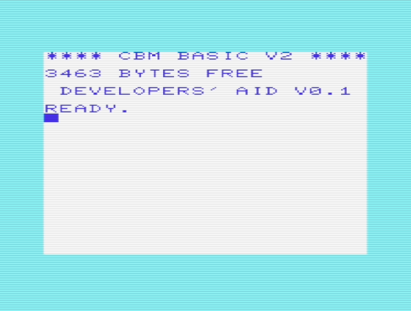

# Developer's Aid for VIC-20

**Hacked together by ops in 2019-2020**

Developer's Aid is a cartridge for VIC-20 developers to help testing and
debugging software on real VIC-20 hardware.

It is based on

- [Programmer's Aid](http://sleepingelephant.com/denial/wiki/index.php?title=VIC-1212_Programmers_Aid_Cartridge) cartridge
- [Over5](http://www.kahlin.net/daniel/over5/) transferring program
by Daniel Kahlin
- C'mon Machine Code Monitor by Aleksi Eeben

# Documentation

[Manual](http://www.zimmers.net/anonftp/pub/cbm/vic20/manuals/VIC_1212_Programmers_Aid.pdf) for the original Programmer's Aid

[Manual](http://www.zimmers.net/anonftp/pub/cbm/vic20/programming/cmon.txt)
for C'mon

Over5 [documentation](https://github.com/ops/over5/tree/master/doc)

Additional commands:

| Command   | Description |
| --------- | ----------- |
| OLD       | Recover a BASIC program |
| CMON      | Start Machine Code Monitor |
| O5RCV     | Receive a file from host via serial line |
| O5SND     | Send a file to host via serial line |
| DIRECTORY | Display disk direcrory directly to the screen |
| DISKCMD   | Send a disk command to the drive or read the status of the drive|

# Serial Hardware

File transfer between host computer and VIC-20 needs serial cable connection.
VIC-20 user port has built in RS-232 interface but it uses TTL signal
levels (0 to 5V) rather than normal RS-232 -12 to 12 voltage range.

[VIC-1011A RS-232 adapter](http://sleepingelephant.com/denial/wiki/index.php?title=VIC-1011A_RS232C_adapter)
allows standard RS-232 devices to be connected to VIC-20. However, device
can be hard to find nowadays. In addition, many modern PCs no longer
have a serial port.

Fortunately, there is a simple and cheap alternative: USB to TTL serial
converter.

I have tested two different converters with Linux and both work well.

CP210 chip based converter.

PL203 chip based converter.

# Demo video

See over5 file transfer in action!

# Releases

## Release v0.1 (2019-09-26)

Initial release for testing.

Download [devaid-v0.1.zip](devaid-v0.1.zip).

## Release v0.2 (2020-07-04)

Second release for testing.

Download [devaid-v0.2.zip](devaid-v0.2.zip).
